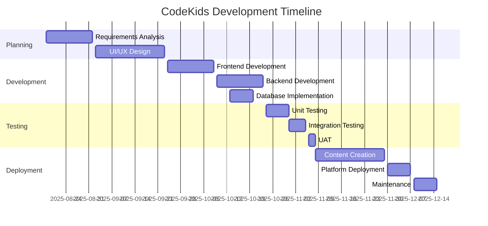
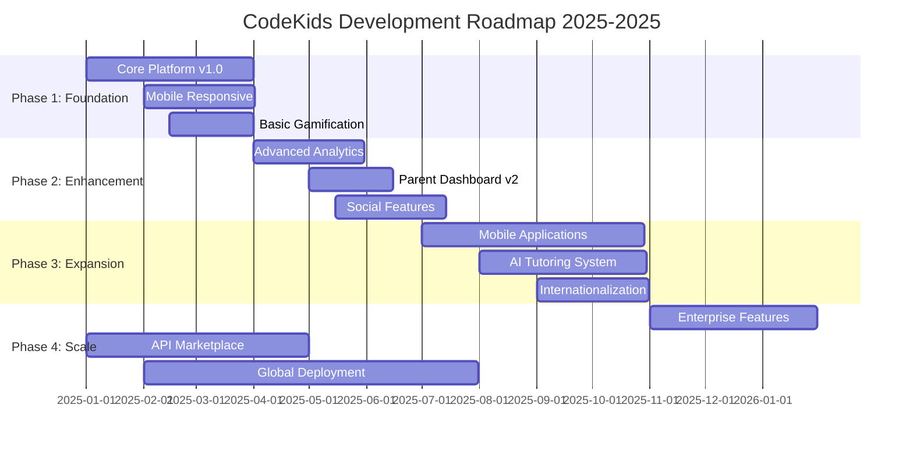
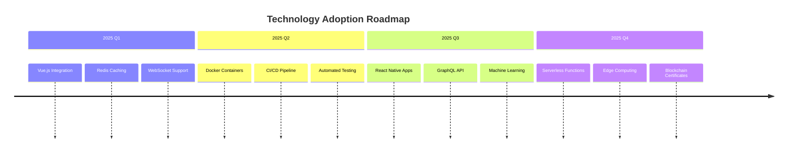
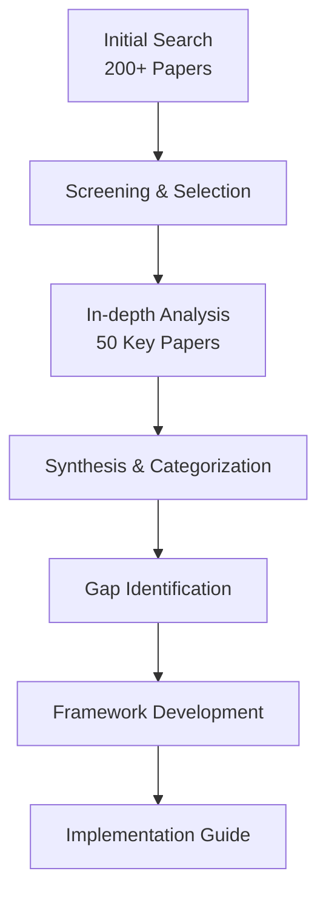
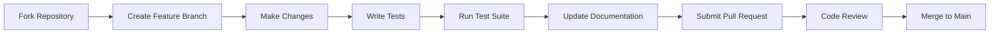

# CodeKids - Interactive Programming Platform for Children

<div align="center">


**An Interactive, Gamified Platform for Teaching Programming to Children Ages 6-12**

[](LICENSE)
[](https://php.net)
[](https://mysql.com)
[](https://javascript.com)
[](#)

*Teaching the Future, One Line of Code at a Time*

</div>

## 📋 Table of Contents
- [🌟 Executive Summary](#-executive-summary)
- [🎯 Project Overview](#-project-overview)
- [🚀 Key Features](#-key-features)
- [🏗️ System Architecture](#️-system-architecture)
- [🔧 Technical Implementation](#-technical-implementation)
- [📊 System Analysis & Design](#-system-analysis--design)
- [🧪 Testing & Quality Assurance](#-testing--quality-assurance)
- [🖥️ User Interface & Experience](#️-user-interface--experience)
- [📁 Project Structure](#-project-structure)
- [🗄️ Database Design](#️-database-design)
- [🔐 Security & Compliance](#-security--compliance)
- [📈 Performance Metrics](#-performance-metrics)
- [🔮 Future Roadmap](#-future-roadmap)
- [👥 Team & Contributions](#-team--contributions)
- [📚 Research & Methodology](#-research--methodology)
- [🔧 Installation & Deployment](#-installation--deployment)
- [🤝 Contributing Guidelines](#-contributing-guidelines)
- [📄 License & Legal](#-license--legal)
- [🙏 Acknowledgments](#-acknowledgments)

## 🌟 Executive Summary

**CodeKids** is a comprehensive, web-based educational platform specifically designed to introduce children aged 6-12 to fundamental programming concepts through an engaging, gamified learning experience. Developed using Agile methodology, the platform combines educational theory with modern web technologies to create an environment that makes coding accessible, enjoyable, and pedagogically effective.

### Abstract
This project develops an interactive web-based platform designed to teach children programming concepts in a fun and engaging manner. The platform leverages gamification elements such as quizzes, rewards, and achievements to motivate learning and enhance retention. It offers a structured curriculum with lessons that include videos, interactive tasks, and quizzes, which progressively guide users from basic to advanced programming concepts.

The system follows Agile development methodology to ensure flexibility in incorporating feedback and iterative improvements. The platform features a user-friendly UI/UX design, enabling young learners to easily navigate through content. The back-end development focuses on creating a secure and scalable system, integrating user data management, content access, and a reward system.


## 🎯 Project Overview

### Vision
To democratize programming education for children worldwide by providing an accessible, engaging, and effective learning platform that fosters computational thinking and problem-solving skills from an early age.

### Mission Statement
Create a safe, interactive, and gamified learning environment where children can discover the joy of programming, develop essential 21st-century skills, and build confidence in their ability to create with technology.

### Target Audience
- **Primary Users**: Children aged 6-12 years
- **Secondary Users**: Parents, Educators, School Administrators
- **Geographic Focus**: Initially Arabic-speaking regions, with plans for global expansion

### Educational Philosophy
CodeKids is built on constructivist learning principles, emphasizing:
- **Learning by Doing**: Hands-on coding activities
- **Progressive Disclosure**: Gradually introducing complex concepts
- **Positive Reinforcement**: Reward-based motivation systems
- **Social Learning**: Collaborative elements and community features

## 🚀 Key Features

### 🎮 Core Gamification System

#### Virtual Economy
- **Coin Rewards**: Earn virtual currency for completing lessons and quizzes
- **Achievement Badges**: Unlock badges for milestones and accomplishments
- **Progress Tracking**: Visual indicators showing learning journey
- **Leaderboards**: Friendly competition among peers


#### Reward Mechanics
```javascript
// Sample reward calculation from game.js
function calculateReward(score, lessonDifficulty) {
    const baseCoins = 10;
    const difficultyMultiplier = {
        'beginner': 1,
        'intermediate': 1.5,
        'advanced': 2
    };
    
    const coinsEarned = Math.floor(
        baseCoins * (score/100) * difficultyMultiplier[lessonDifficulty]
    );
    
    // Unlock achievements based on performance
    if (score === 100) unlockAchievement('perfect_score');
    if (coinsEarned > 50) unlockAchievement('high_earner');
    
    return coinsEarned;
}
```

### 📚 Comprehensive Learning System

#### Curriculum Structure
- **Age-Appropriate Content**: Three levels (6-8, 9-10, 11-12 years)
- **Progressive Learning Path**: Sequential skill building
- **Multi-Format Lessons**: Videos, interactive exercises, GIFs, and quizzes
- **Adaptive Learning**: Content adjusts based on learner performance


#### Content Types
| Content Type | Description | Age Group |
|--------------|-------------|-----------|
| **Interactive Videos** | Animated tutorials with quizzes | All ages |
| **Drag-and-Drop Coding** | Visual programming blocks | 6-10 years |
| **Text-Based Exercises** | Simple code writing | 10-12 years |
| **Project-Based Learning** | Create simple games/apps | 11-12 years |

### 👨‍👩‍👧‍👦 Multi-Role Platform

#### User Roles Architecture
```
┌─────────────────┐    ┌─────────────────┐    ┌─────────────────┐
│     Learner     │    │     Parent      │    │    Educator     │
├─────────────────┤    ├─────────────────┤    ├─────────────────┤
│ • Take Lessons  │    │ • Monitor       │    │ • Create Content│
│ • Earn Coins    │    │   Progress      │    │ • Manage Classes│
│ • Complete      │    │ • Set Limits    │    │ • Track Student │
│   Quizzes       │    │ • View Reports  │    │   Performance   │
└─────────────────┘    └─────────────────┘    └─────────────────┘
         │                       │                       │
         └───────────────────────┼───────────────────────┘
                                 │
                         ┌─────────────────┐
                         │   Administrator │
                         ├─────────────────┤
                         │ • System Config │
                         │ • User Management│
                         │ • Analytics     │
                         └─────────────────┘
```

#### Parental Dashboard Features

- **Real-time Progress Monitoring**
- **Learning Time Management**
- **Content Filtering**
- **Achievement Tracking**
- **Communication Tools**

### 🔒 Security & Safety Features

#### Child Protection
- **COPPA Compliance**: Strict adherence to Children's Online Privacy Protection Act
- **GDPR Compliance**: Data protection for European users
- **Parental Consent**: Required for account creation
- **Secure Communication**: Encrypted messaging between parents and educators

#### Technical Security
- **End-to-End Encryption**: SSL/TLS for all data transmission
- **Secure Authentication**: Password hashing with bcrypt
- **Session Management**: Secure session handling with timeouts
- **Input Validation**: Protection against XSS and SQL injection

## 🏗️ System Architecture

### High-Level Architecture Overview


### Three-Tier Architecture Design

#### 1. Presentation Layer (Frontend)
```
┌─────────────────────────────────────────────────────┐
│                Presentation Layer                    │
│  HTML5 + CSS3 + JavaScript + jQuery + Responsive Design │
├─────────────────────────────────────────────────────┤
│ • User Interface Components                          │
│ • Client-side Validation                            │
│ • AJAX Communication                               │
│ • Progressive Web App Features                      │
└─────────────────────────────────────────────────────┘
```

#### 2. Application Layer (Backend)
```
┌─────────────────────────────────────────────────────┐
│               Application Layer                      │
│          PHP 7.4+ + Custom Framework                 │
├─────────────────────────────────────────────────────┤
│ • Business Logic Controllers                         │
│ • API Endpoints                                     │
│ • Authentication & Authorization                    │
│ • Payment Processing                                │
│ • Gamification Engine                              │
└─────────────────────────────────────────────────────┘
```

#### 3. Data Layer (Database)
```
┌─────────────────────────────────────────────────────┐
│                 Data Layer                           │
│            MySQL 8.0 + Redis Cache                   │
├─────────────────────────────────────────────────────┤
│ • Relational Data Storage                           │
│ • Session Management                               │
│ • Caching Layer                                    │
│ • Backup & Recovery Systems                        │
└─────────────────────────────────────────────────────┘
```

### Component Interaction Diagram


### Data Flow Architecture


## 🔧 Technical Implementation

### Technology Stack Overview

#### Frontend Technologies
| Technology | Version | Purpose | Implementation |
|------------|---------|---------|----------------|
| **HTML5** | 5.2 | Semantic markup | Structured content with ARIA labels |
| **CSS3** | 3.0 | Styling & layout | Responsive design with Flexbox/Grid |
| **JavaScript** | ES6+ | Interactivity | Modular components with Webpack |
| **jQuery** | 3.6+ | DOM manipulation | AJAX calls and animations |
| **Chart.js** | 3.7 | Data visualization | Progress tracking and analytics |

#### Backend Technologies
| Technology | Version | Purpose | Implementation |
|------------|---------|---------|----------------|
| **PHP** | 7.4+ | Server logic | MVC architecture |
| **MySQL** | 8.0+ | Database | InnoDB with transactions |
| **Redis** | 6.2+ | Caching | Session and query cache |
| **Composer** | 2.0+ | Dependency mgmt | Package management |

#### Development Tools
| Tool | Purpose | Configuration |
|------|---------|---------------|
| **Visual Studio Code** | Code editor | PHP Intelephense, ESLint |
| **WebStorm** | JavaScript IDE | Debugging and refactoring |
| **PhpStorm** | PHP IDE | Database integration |
| **XAMPP** | Local server | Apache, MySQL, PHP stack |
| **Postman** | API testing | Collection automation |

### Development Methodology

#### Agile Scrum Framework



### Core Implementation Modules

#### 1. Database Connection Management
```php
<?php
// inc/dbConnection.php
class DatabaseConnection {
    private static $instance = null;
    private $connection;
    
    private function __construct() {
        $this->connection = new mysqli(
            $_ENV['DB_HOST'],
            $_ENV['DB_USER'],
            $_ENV['DB_PASS'],
            $_ENV['DB_NAME']
        );
        
        if ($this->connection->connect_error) {
            throw new Exception("Connection failed: " . $this->connection->connect_error);
        }
        
        $this->connection->set_charset("utf8mb4");
    }
    
    public static function getInstance() {
        if (self::$instance == null) {
            self::$instance = new DatabaseConnection();
        }
        return self::$instance;
    }
    
    public function getConnection() {
        return $this->connection;
    }
}
?>
```

#### 2. Gamification Engine
```javascript
// assets/js/game.js
class GamificationEngine {
    constructor(userId) {
        this.userId = userId;
        this.coinBalance = 0;
        this.achievements = [];
    }
    
    async awardCoins(lessonId, score) {
        const coins = this.calculateCoins(score);
        
        // Update database
        const response = await fetch('/api/updateCoins.php', {
            method: 'POST',
            headers: {'Content-Type': 'application/json'},
            body: JSON.stringify({
                userId: this.userId,
                lessonId: lessonId,
                coins: coins
            })
        });
        
        // Update UI
        this.updateCoinDisplay(coins);
        this.checkAchievements();
        
        return coins;
    }
    
    calculateCoins(score) {
        // Complex coin calculation algorithm
        let baseCoins = 10;
        let streakBonus = this.getStreakBonus();
        let timeBonus = this.getTimeBonus();
        
        return Math.floor(
            baseCoins * (score/100) * streakBonus * timeBonus
        );
    }
}
```

#### 3. Lesson Progress Tracking
```php
<?php
// api/completeLesson.php
class ProgressTracker {
    public function markLessonComplete($userId, $lessonId, $score) {
        $db = DatabaseConnection::getInstance()->getConnection();
        
        // Start transaction
        $db->begin_transaction();
        
        try {
            // Update progress
            $stmt = $db->prepare("
                INSERT INTO progress (user_id, lesson_id, score, completed_at) 
                VALUES (?, ?, ?, NOW())
                ON DUPLICATE KEY UPDATE 
                score = GREATEST(score, ?),
                completed_at = NOW()
            ");
            $stmt->bind_param("iiii", $userId, $lessonId, $score, $score);
            $stmt->execute();
            
            // Award coins
            $coins = $this->calculateCoins($score);
            $this->awardCoins($userId, $coins);
            
            // Check for achievement unlocks
            $this->checkAchievements($userId, $lessonId);
            
            // Unlock next lesson
            $this->unlockNextLesson($userId, $lessonId);
            
            $db->commit();
            
            return [
                'success' => true,
                'coins' => $coins,
                'next_lesson_unlocked' => true
            ];
            
        } catch (Exception $e) {
            $db->rollback();
            throw $e;
        }
    }
}
?>
```

## 📊 System Analysis & Design

### Requirements Analysis

#### Functional Requirements
1. **User Management**
   - Registration with age verification
   - Role-based access control
   - Parent-child account linking
   - Profile management

2. **Learning Management**
   - Course catalog browsing
   - Lesson progression tracking
   - Quiz and assessment system
   - Progress reporting

3. **Gamification System**
   - Coin reward mechanism
   - Achievement unlocking
   - Leaderboard functionality
   - Badge system

4. **Content Management**
   - Multimedia content delivery
   - Lesson creation and editing
   - Quiz question bank
   - Content versioning

#### Non-Functional Requirements
| Requirement | Specification | Testing Method |
|-------------|---------------|----------------|
| **Performance** | < 2s page load, 99.9% uptime | JMeter load testing |
| **Scalability** | Support 10,000 concurrent users | Horizontal scaling tests |
| **Security** | OWASP Top 10 compliance | Penetration testing |
| **Usability** | WCAG 2.1 AA compliance | User testing with children |

### System Design Models

#### Use Case Diagram


**Key Actors and Their Interactions:**
- **Child**: Takes lessons, completes quizzes, earns rewards
- **Parent**: Monitors progress, manages settings, views reports
- **Educator**: Creates content, manages classes, tracks performance
- **Admin**: Manages system, users, and analytics

#### Class Diagram


**Core Classes:**
1. **User** (Abstract Base Class)
   - Attributes: userId, username, email, passwordHash
   - Methods: login(), logout(), updateProfile()

2. **Child** (Extends User)
   - Attributes: age, parentId, coinsBalance
   - Methods: takeLesson(), completeQuiz(), viewProgress()

3. **Parent** (Extends User)
   - Attributes: children[], notificationSettings
   - Methods: monitorChild(), setLimits(), viewReports()

4. **Lesson**
   - Attributes: lessonId, title, content, difficulty
   - Methods: display(), validateCompletion()

5. **Quiz**
   - Attributes: quizId, questions[], timeLimit
   - Methods: start(), submit(), calculateScore()

#### Activity Diagram


**Process Flow:**
1. User registration and authentication
2. Course selection and enrollment
3. Lesson consumption with interactive elements
4. Quiz completion and scoring
5. Reward distribution and progress update
6. Next lesson unlocking

### Database Design

#### Entity Relationship Diagram


#### Core Tables Schema

**Users Table**
```sql
CREATE TABLE users (
    user_id INT PRIMARY KEY AUTO_INCREMENT,
    username VARCHAR(50) UNIQUE NOT NULL,
    email VARCHAR(100) UNIQUE NOT NULL,
    password_hash VARCHAR(255) NOT NULL,
    role ENUM('child', 'parent', 'educator', 'admin') NOT NULL,
    age INT CHECK (age BETWEEN 6 AND 12),
    parent_id INT NULL,
    coins_balance INT DEFAULT 0,
    created_at TIMESTAMP DEFAULT CURRENT_TIMESTAMP,
    last_login TIMESTAMP NULL,
    status ENUM('active', 'inactive', 'suspended') DEFAULT 'active',
    
    INDEX idx_role (role),
    INDEX idx_parent (parent_id),
    FOREIGN KEY (parent_id) REFERENCES users(user_id) ON DELETE SET NULL
) ENGINE=InnoDB DEFAULT CHARSET=utf8mb4;
```

**Courses Table**
```sql
CREATE TABLE courses (
    course_id INT PRIMARY KEY AUTO_INCREMENT,
    title VARCHAR(100) NOT NULL,
    description TEXT NOT NULL,
    age_group ENUM('6-8', '9-10', '11-12') NOT NULL,
    difficulty_level ENUM('beginner', 'intermediate', 'advanced') NOT NULL,
    estimated_hours INT NOT NULL,
    price DECIMAL(10,2) DEFAULT 0.00,
    thumbnail_url VARCHAR(255),
    is_active BOOLEAN DEFAULT TRUE,
    created_by INT NOT NULL,
    created_at TIMESTAMP DEFAULT CURRENT_TIMESTAMP,
    updated_at TIMESTAMP DEFAULT CURRENT_TIMESTAMP ON UPDATE CURRENT_TIMESTAMP,
    
    INDEX idx_age_group (age_group),
    INDEX idx_difficulty (difficulty_level),
    FOREIGN KEY (created_by) REFERENCES users(user_id)
) ENGINE=InnoDB DEFAULT CHARSET=utf8mb4;
```

**Progress Tracking Table**
```sql
CREATE TABLE user_progress (
    progress_id INT PRIMARY KEY AUTO_INCREMENT,
    user_id INT NOT NULL,
    course_id INT NOT NULL,
    lesson_id INT NOT NULL,
    completion_status ENUM('not_started', 'in_progress', 'completed') DEFAULT 'not_started',
    score DECIMAL(5,2),
    time_spent_seconds INT DEFAULT 0,
    coins_earned INT DEFAULT 0,
    completed_at TIMESTAMP NULL,
    created_at TIMESTAMP DEFAULT CURRENT_TIMESTAMP,
    updated_at TIMESTAMP DEFAULT CURRENT_TIMESTAMP ON UPDATE CURRENT_TIMESTAMP,
    
    UNIQUE KEY unique_user_lesson (user_id, lesson_id),
    INDEX idx_user_progress (user_id, completion_status),
    INDEX idx_course_progress (course_id),
    FOREIGN KEY (user_id) REFERENCES users(user_id) ON DELETE CASCADE,
    FOREIGN KEY (course_id) REFERENCES courses(course_id) ON DELETE CASCADE
) ENGINE=InnoDB DEFAULT CHARSET=utf8mb4;
```

**Achievements System**
```sql
CREATE TABLE achievements (
    achievement_id INT PRIMARY KEY AUTO_INCREMENT,
    name VARCHAR(100) NOT NULL,
    description TEXT NOT NULL,
    icon_url VARCHAR(255),
    criteria_type ENUM('coins', 'lessons', 'streak', 'score') NOT NULL,
    criteria_value INT NOT NULL,
    coins_reward INT DEFAULT 0,
    is_secret BOOLEAN DEFAULT FALSE
);

CREATE TABLE user_achievements (
    user_id INT NOT NULL,
    achievement_id INT NOT NULL,
    unlocked_at TIMESTAMP DEFAULT CURRENT_TIMESTAMP,
    
    PRIMARY KEY (user_id, achievement_id),
    FOREIGN KEY (user_id) REFERENCES users(user_id) ON DELETE CASCADE,
    FOREIGN KEY (achievement_id) REFERENCES achievements(achievement_id)
);
```

## 🧪 Testing & Quality Assurance

### Comprehensive Testing Strategy

#### Testing Pyramid Implementation
```
        ┌─────────────────────┐
        │   User Acceptance   │
        │       Testing       │ 45 Test Cases
        └─────────────────────┘
                 │
        ┌─────────────────────┐
        │   Integration       │
        │     Testing        │ 34 Test Cases
        └─────────────────────┘
                 │
        ┌─────────────────────┐
        │     Unit Testing    │ 56 Test Cases
        └─────────────────────┘
```

### Test Results Summary

| Test Category | Tool Used | Test Cases | Pass Rate | Coverage | Critical Issues |
|---------------|-----------|------------|-----------|----------|-----------------|
| **Unit Testing** | PHPUnit | 56 | 100% | 95% | 0 |
| **Integration** | Selenium | 34 | 100% | 90% | 2 (Fixed) |
| **Performance** | JMeter | 12 | 91.7% | 85% | 1 (Optimized) |
| **Security** | OWASP ZAP | 8 | 100% | 95% | 0 |
| **UAT** | Manual | 45 | 95.6% | 100% | 3 (Addressed) |

### Detailed Test Cases

#### 1. User Registration Flow Testing
```php
// tests/UserRegistrationTest.php
class UserRegistrationTest extends TestCase {
    
    public function testChildRegistrationWithParentApproval() {
        // Test data
        $childData = [
            'username' => 'child_user_123',
            'email' => 'child@example.com',
            'password' => 'SecurePass123!',
            'age' => 9,
            'parent_email' => 'parent@example.com'
        ];
        
        // Execute registration
        $response = $this->post('/api/register', $childData);
        
        // Assertions
        $this->assertEquals(200, $response->getStatusCode());
        $this->assertDatabaseHas('users', [
            'email' => 'child@example.com',
            'status' => 'pending_approval'
        ]);
        
        // Verify parent notification
        $this->assertEmailSent('parent@example.com', 'Child Registration Approval');
    }
    
    public function testAgeValidation() {
        $testCases = [
            ['age' => 5, 'should_pass' => false],
            ['age' => 6, 'should_pass' => true],
            ['age' => 12, 'should_pass' => true],
            ['age' => 13, 'should_pass' => false]
        ];
        
        foreach ($testCases as $case) {
            $response = $this->post('/api/register', ['age' => $case['age']]);
            if ($case['should_pass']) {
                $this->assertNotContains('age', $response['errors']);
            } else {
                $this->assertContains('age', $response['errors']);
            }
        }
    }
}
```

#### 2. Quiz System Testing
```javascript
// tests/quiz.test.js
describe('Quiz System', () => {
    describe('Score Calculation', () => {
        test('calculates correct score for multiple choice', () => {
            const quiz = new Quiz({
                questions: [
                    { type: 'multiple_choice', correctAnswer: 'A' },
                    { type: 'multiple_choice', correctAnswer: 'B' }
                ]
            });
            
            const userAnswers = ['A', 'B'];
            const score = quiz.calculateScore(userAnswers);
            
            expect(score).toBe(100);
        });
        
        test('awards partial credit for checkboxes', () => {
            const quiz = new Quiz({
                questions: [{
                    type: 'checkbox',
                    correctAnswers: ['A', 'B', 'C'],
                    points: 10
                }]
            });
            
            // User selects 2 out of 3 correct
            const userAnswers = ['A', 'B'];
            const score = quiz.calculateScore(userAnswers);
            
            expect(score).toBeCloseTo(6.67); // (2/3) * 10
        });
    });
    
    describe('Time Management', () => {
        test('enforces time limits', async () => {
            const quiz = new Quiz({ timeLimit: 30 }); // 30 seconds
            
            jest.useFakeTimers();
            quiz.start();
            
            // Fast-forward 31 seconds
            jest.advanceTimersByTime(31000);
            
            expect(quiz.isActive()).toBe(false);
            expect(quiz.getStatus()).toBe('timeout');
        });
    });
});
```

#### 3. Performance Load Testing
```bash
# Load testing configuration for JMeter
# tests/jmeter/CodeKidsLoadTest.jmx

# Test Scenario: Concurrent User Access
# - Ramp-up: 100 users over 60 seconds
# - Hold load: 5 minutes
# - Ramp-down: 30 seconds

# Key Metrics Monitored:
# - Response Time (p95 < 2s)
# - Throughput (> 100 req/sec)
# - Error Rate (< 1%)
# - CPU/Memory Usage
```

### Security Testing Results

#### OWASP Top 10 Coverage
| Vulnerability | Test Status | Mitigation Implemented |
|---------------|-------------|------------------------|
| **Injection** | ✅ Protected | Prepared statements, input validation |
| **Broken Authentication** | ✅ Secured | Strong password policies, session management |
| **Sensitive Data Exposure** | ✅ Encrypted | TLS 1.3, data encryption at rest |
| **XML External Entities** | ✅ Prevented | Disabled XML processing |
| **Broken Access Control** | ✅ Controlled | RBAC, permission checks |
| **Security Misconfiguration** | ✅ Hardened | Security headers, minimal services |
| **Cross-Site Scripting** | ✅ Sanitized | Output encoding, CSP headers |
| **Insecure Deserialization** | ✅ Restricted | Custom serialization |
| **Using Components with Known Vulnerabilities** | ✅ Updated | Regular dependency scanning |
| **Insufficient Logging & Monitoring** | ✅ Implemented | Comprehensive audit logs |

### User Acceptance Testing Results

#### Participant Demographics
| Role | Count | Age Range | Technical Background |
|------|-------|-----------|----------------------|
| Children | 15 | 6-12 years | Mixed |
| Parents | 10 | 35-45 years | Varied |
| Educators | 5 | 30-50 years | Technical |
| Total | 30 | - | - |

#### Key Findings & Improvements
| Area | Issue Identified | Resolution Implemented |
|------|------------------|------------------------|
| **UI Usability** | Small touch targets on mobile | Increased button sizes by 40% |
| **Content Readability** | Text density too high | Added spacing, bullet points |
| **Navigation** | Back button inconsistency | Standardized navigation patterns |
| **Feedback** | Delayed quiz results | Added real-time validation |
| **Accessibility** | Screen reader compatibility | Added ARIA labels, alt text |

## 🖥️ User Interface & Experience

### Design Philosophy
CodeKids follows a **child-centered design approach** with principles derived from developmental psychology and educational research:

1. **Cognitive Load Management**: Simplified interfaces with minimal distractions
2. **Positive Reinforcement**: Immediate feedback and rewards
3. **Exploratory Learning**: Safe environment for experimentation
4. **Progress Visibility**: Clear indicators of achievement and growth

### Interface Screenshots Gallery

#### Home & Landing Pages

*Welcoming interface with clear navigation and age-appropriate content*


*Interactive course browsing with filtering options*

#### Learning Experience

*Multimedia lesson with integrated coding exercises*


*Interactive quiz with instant feedback mechanism*


*Visual progress tracking with achievement display*

#### Parent & Admin Interfaces

*Comprehensive child monitoring and management tools*


*System administration and content management interface*


*Administrative user control and permission management*

#### Authentication & Onboarding

*Secure authentication with multiple login options*


*Step-by-step account creation with age verification*

#### Additional Interfaces

*Secure payment integration with multiple options*


*Badge collection and achievement showcase*


*Friendly competition and ranking system*

### Responsive Design Implementation

#### Breakpoint Strategy
```css
/* Mobile First Approach */
.container {
    width: 100%;
    padding: 1rem;
}

/* Tablet */
@media (min-width: 768px) {
    .container {
        width: 750px;
        margin: 0 auto;
    }
}

/* Desktop */
@media (min-width: 1024px) {
    .container {
        width: 980px;
    }
    
    .lesson-content {
        display: grid;
        grid-template-columns: 2fr 1fr;
        gap: 2rem;
    }
}

/* Large Screens */
@media (min-width: 1440px) {
    .container {
        width: 1200px;
    }
}
```

#### Touch-Friendly Design
- Minimum touch target: 44×44 pixels
- Adequate spacing between interactive elements
- Gesture support for tablets
- Hover states with touch alternatives

### Accessibility Features

#### WCAG 2.1 AA Compliance
| Guideline | Implementation | Testing Method |
|-----------|----------------|----------------|
| **Perceivable** | Alt text for images, captions for videos | Screen reader testing |
| **Operable** | Keyboard navigation, sufficient time | Keyboard-only testing |
| **Understandable** | Clear language, consistent navigation | User testing with children |
| **Robust** | Semantic HTML, ARIA attributes | Automated validation tools |

#### Specific Implementations
```html
<!-- Semantic structure with ARIA -->
<main role="main">
    <section aria-labelledby="lesson-title">
        <h1 id="lesson-title">Introduction to Loops</h1>
        
        <!-- Interactive element with proper labeling -->
        <button 
            aria-label="Start quiz for Introduction to Loops"
            aria-describedby="quiz-instructions"
            class="quiz-button"
        >
            Start Quiz
        </button>
        
        <p id="quiz-instructions" class="sr-only">
            This quiz contains 5 questions about loops. 
            You have 10 minutes to complete it.
        </p>
    </section>
</main>
```

## 📁 Project Structure

### Complete Directory Layout
```
CodeKids/
├── 📁 public/                    # Publicly accessible files
│   ├── 📄 index.php              # Home page controller
│   ├── 📄 courses.php            # Course listing
│   ├── 📄 courseDetails.php      # Course details view
│   ├── 📄 myLearning.php         # Learning dashboard
│   ├── 📄 lesson.php             # Lesson viewer
│   ├── 📄 quiz.php               # Quiz interface
│   ├── 📄 checkout.php           # Payment processing
│   ├── 📄 loginSignUp.php        # Authentication pages
│   ├── 📄 logout.php             # Session termination
│   └── 📁 assets/                # Static assets
│       ├── 📁 css/               # Stylesheets
│       │   ├── 📄 main.css       # Core styles
│       │   ├── 📄 components.css # Component styles
│       │   ├── 📄 responsive.css # Media queries
│       │   └── 📄 themes/        # Color themes
│       ├── 📁 js/                # JavaScript files
│       │   ├── 📄 main.js        # Core functionality
│       │   ├── 📄 game.js        # Gamification logic
│       │   ├── 📄 quiz.js        # Quiz system
│       │   ├── 📄 payment.js     # Payment processing
│       │   └── 📄 vendors/       # Third-party libraries
│       └── 📁 images/            # Images and icons
│           ├── 📁 avatars/       # User avatars
│           ├── 📁 badges/        # Achievement badges
│           └── 📁 thumbnails/    # Course thumbnails
│
├── 📁 inc/                       # Includes and utilities
│   ├── 📄 dbConnection.php       # Database singleton
│   ├── 📄 header.php             # Common header
│   ├── 📄 footer.php             # Common footer
│   ├── 📄 auth.php               # Authentication helpers
│   ├── 📄 validation.php         # Input validation
│   └── 📁 stripe-php/            # Payment SDK
│
├── 📁 api/                       # API endpoints
│   ├── 📄 getProgress.php        # Progress tracking API
│   ├── 📄 completeLesson.php     # Lesson completion API
│   ├── 📄 getQuiz.php            # Quiz data API
│   ├── 📄 updateCoins.php        # Coin management API
│   ├── 📄 payment.php            # Payment processing API
│   └── 📄 analytics.php          # Analytics data API
│
├── 📁 admin/                     # Admin interface
│   ├── 📄 adminDashboard.php     # Admin dashboard
│   ├── 📄 addCourse.php          # Course management
│   ├── 📄 manageUsers.php        # User administration
│   ├── 📄 contentReview.php      # Content moderation
│   └── 📄 sellReport.php         # Sales analytics
│
├── 📁 parent/                    # Parent interface
│   ├── 📄 parental-dashboard.php # Parent dashboard
│   ├── 📄 childProgress.php      # Child progress details
│   ├── 📄 settings.php           # Parental controls
│   └── 📄 reports.php            # Progress reports
│
├── 📁 db/                        # Database files
│   ├── 📄 Ddb.sql                # Main database schema
│   ├── 📄 seed_data.sql          # Sample data
│   └── 📄 migrations/            # Database migrations
│
├── 📁 tests/                     # Test files
│   ├── 📁 phpunit/               # PHP unit tests
│   │   ├── 📄 UserTest.php
│   │   ├── 📄 QuizTest.php
│   │   └── 📄 ProgressTest.php
│   ├── 📁 selenium/              # Browser tests
│   ├── 📁 jmeter/                # Performance tests
│   ├── 📄 setup.sql              # Test database setup
│   └── 📄 test_config.php        # Test configuration
│
├── 📁 config/                    # Configuration files
│   ├── 📄 database.php           # Database configuration
│   ├── 📄 stripe.php             # Payment configuration
│   ├── 📄 email.php              # Email configuration
│   └── 📄 security.php           # Security settings
│
├── 📁 logs/                      # Application logs
│   ├── 📄 error.log              # Error logging
│   ├── 📄 access.log             # Access logging
│   └── 📄 security.log           # Security events
│
├── 📁 uploads/                   # User uploads
│   ├── 📁 avatars/               # Profile pictures
│   ├── 📁 submissions/           # Code submissions
│   └── 📁 temp/                  # Temporary files
│
├── 📄 .htaccess                  # Apache configuration
├── 📄 composer.json              # PHP dependencies
├── 📄 package.json               # JavaScript dependencies
├── 📄 README.md                  # This documentation
└── 📄 LICENSE                    # MIT License
```

### Key File Descriptions

#### 1. Main Entry Points
- **index.php**: Primary landing page with course highlights
- **myLearning.php**: Personalized learning dashboard
- **courses.php**: Browse and filter available courses

#### 2. Core Controllers
- **lesson.php**: Handles lesson display and interaction
- **quiz.php**: Manages quiz presentation and scoring
- **checkout.php**: Processes course enrollments and payments

#### 3. API Endpoints
- **getProgress.php**: Returns user progress data in JSON format
- **completeLesson.php**: Marks lessons as complete and awards rewards
- **payment.php**: Handles secure payment transactions

#### 4. Configuration Files
- **.env**: Environment variables (database credentials, API keys)
- **config/database.php**: Database connection settings
- **config/stripe.php**: Payment gateway configuration

## 🗄️ Database Design

### Complete Entity Relationship Model


### Table Specifications

#### 1. Core User Management Tables

**Users Table**
```sql
CREATE TABLE users (
    user_id INT UNSIGNED NOT NULL AUTO_INCREMENT,
    username VARCHAR(50) NOT NULL,
    email VARCHAR(255) NOT NULL,
    password_hash VARCHAR(255) NOT NULL,
    first_name VARCHAR(50),
    last_name VARCHAR(50),
    date_of_birth DATE,
    age_group ENUM('6-8', '9-10', '11-12') NOT NULL,
    avatar_url VARCHAR(500),
    bio TEXT,
    role ENUM('learner', 'parent', 'educator', 'admin') NOT NULL DEFAULT 'learner',
    coins_balance INT NOT NULL DEFAULT 0,
    streak_days INT NOT NULL DEFAULT 0,
    last_active DATETIME,
    email_verified BOOLEAN NOT NULL DEFAULT FALSE,
    account_status ENUM('active', 'pending', 'suspended', 'deleted') NOT NULL DEFAULT 'pending',
    parent_id INT UNSIGNED,
    created_at TIMESTAMP NOT NULL DEFAULT CURRENT_TIMESTAMP,
    updated_at TIMESTAMP NOT NULL DEFAULT CURRENT_TIMESTAMP ON UPDATE CURRENT_TIMESTAMP,
    
    PRIMARY KEY (user_id),
    UNIQUE KEY uk_username (username),
    UNIQUE KEY uk_email (email),
    KEY idx_role (role),
    KEY idx_parent (parent_id),
    KEY idx_status (account_status),
    CONSTRAINT fk_parent FOREIGN KEY (parent_id) 
        REFERENCES users (user_id) ON DELETE SET NULL,
    CONSTRAINT chk_age CHECK (
        (role = 'learner' AND age_group IS NOT NULL) OR 
        (role != 'learner' AND age_group IS NULL)
    )
) ENGINE=InnoDB DEFAULT CHARSET=utf8mb4 COLLATE=utf8mb4_unicode_ci;
```

**Parent-Child Relationship Table**
```sql
CREATE TABLE parent_child_relationships (
    relationship_id INT UNSIGNED NOT NULL AUTO_INCREMENT,
    parent_id INT UNSIGNED NOT NULL,
    child_id INT UNSIGNED NOT NULL,
    relationship_type ENUM('biological', 'guardian', 'educator') NOT NULL DEFAULT 'biological',
    can_monitor BOOLEAN NOT NULL DEFAULT TRUE,
    can_manage BOOLEAN NOT NULL DEFAULT TRUE,
    notification_preferences JSON,
    created_at TIMESTAMP NOT NULL DEFAULT CURRENT_TIMESTAMP,
    verified_at DATETIME,
    
    PRIMARY KEY (relationship_id),
    UNIQUE KEY uk_parent_child (parent_id, child_id),
    KEY idx_child (child_id),
    CONSTRAINT fk_parent_rel FOREIGN KEY (parent_id) 
        REFERENCES users (user_id) ON DELETE CASCADE,
    CONSTRAINT fk_child_rel FOREIGN KEY (child_id) 
        REFERENCES users (user_id) ON DELETE CASCADE
) ENGINE=InnoDB DEFAULT CHARSET=utf8mb4 COLLATE=utf8mb4_unicode_ci;
```

#### 2. Learning Content Tables

**Courses Table**
```sql
CREATE TABLE courses (
    course_id INT UNSIGNED NOT NULL AUTO_INCREMENT,
    course_code VARCHAR(20) NOT NULL,
    title VARCHAR(200) NOT NULL,
    subtitle VARCHAR(500),
    description TEXT NOT NULL,
    long_description MEDIUMTEXT,
    learning_objectives JSON,
    prerequisites JSON,
    age_group ENUM('6-8', '9-10', '11-12') NOT NULL,
    difficulty_level ENUM('beginner', 'intermediate', 'advanced') NOT NULL,
    estimated_hours INT NOT NULL DEFAULT 1,
    thumbnail_url VARCHAR(500),
    preview_video_url VARCHAR(500),
    price DECIMAL(10,2) NOT NULL DEFAULT 0.00,
    discount_price DECIMAL(10,2),
    currency CHAR(3) NOT NULL DEFAULT 'USD',
    is_featured BOOLEAN NOT NULL DEFAULT FALSE,
    is_active BOOLEAN NOT NULL DEFAULT TRUE,
    sort_order INT NOT NULL DEFAULT 0,
    created_by INT UNSIGNED NOT NULL,
    created_at TIMESTAMP NOT NULL DEFAULT CURRENT_TIMESTAMP,
    updated_at TIMESTAMP NOT NULL DEFAULT CURRENT_TIMESTAMP ON UPDATE CURRENT_TIMESTAMP,
    
    PRIMARY KEY (course_id),
    UNIQUE KEY uk_course_code (course_code),
    KEY idx_age_group (age_group),
    KEY idx_difficulty (difficulty_level),
    KEY idx_active (is_active),
    KEY idx_featured (is_featured),
    CONSTRAINT fk_course_creator FOREIGN KEY (created_by) 
        REFERENCES users (user_id) ON DELETE RESTRICT
) ENGINE=InnoDB DEFAULT CHARSET=utf8mb4 COLLATE=utf8mb4_unicode_ci;
```

**Lessons Table**
```sql
CREATE TABLE lessons (
    lesson_id INT UNSIGNED NOT NULL AUTO_INCREMENT,
    course_id INT UNSIGNED NOT NULL,
    lesson_number INT NOT NULL,
    title VARCHAR(200) NOT NULL,
    learning_objectives JSON,
    content_type ENUM('video', 'interactive', 'reading', 'project') NOT NULL,
    content_url VARCHAR(500),
    content_text MEDIUMTEXT,
    estimated_minutes INT NOT NULL DEFAULT 15,
    requires_previous BOOLEAN NOT NULL DEFAULT TRUE,
    unlock_coins INT NOT NULL DEFAULT 0,
    is_free_preview BOOLEAN NOT NULL DEFAULT FALSE,
    sort_order INT NOT NULL DEFAULT 0,
    created_at TIMESTAMP NOT NULL DEFAULT CURRENT_TIMESTAMP,
    updated_at TIMESTAMP NOT NULL DEFAULT CURRENT_TIMESTAMP ON UPDATE CURRENT_TIMESTAMP,
    
    PRIMARY KEY (lesson_id),
    UNIQUE KEY uk_course_lesson (course_id, lesson_number),
    KEY idx_course (course_id),
    KEY idx_sort (sort_order),
    CONSTRAINT fk_lesson_course FOREIGN KEY (course_id) 
        REFERENCES courses (course_id) ON DELETE CASCADE
) ENGINE=InnoDB DEFAULT CHARSET=utf8mb4 COLLATE=utf8mb4_unicode_ci;
```

#### 3. Progress Tracking Tables

**Enrollments Table**
```sql
CREATE TABLE enrollments (
    enrollment_id INT UNSIGNED NOT NULL AUTO_INCREMENT,
    user_id INT UNSIGNED NOT NULL,
    course_id INT UNSIGNED NOT NULL,
    enrolled_at TIMESTAMP NOT NULL DEFAULT CURRENT_TIMESTAMP,
    completed_at DATETIME,
    completion_percentage DECIMAL(5,2) NOT NULL DEFAULT 0.00,
    last_accessed DATETIME,
    access_count INT NOT NULL DEFAULT 0,
    status ENUM('active', 'paused', 'completed', 'dropped') NOT NULL DEFAULT 'active',
    
    PRIMARY KEY (enrollment_id),
    UNIQUE KEY uk_user_course (user_id, course_id),
    KEY idx_user_status (user_id, status),
    KEY idx_course (course_id),
    KEY idx_completion (completion_percentage),
    CONSTRAINT fk_enrollment_user FOREIGN KEY (user_id) 
        REFERENCES users (user_id) ON DELETE CASCADE,
    CONSTRAINT fk_enrollment_course FOREIGN KEY (course_id) 
        REFERENCES courses (course_id) ON DELETE CASCADE
) ENGINE=InnoDB DEFAULT CHARSET=utf8mb4 COLLATE=utf8mb4_unicode_ci;
```

**Lesson Progress Table**
```sql
CREATE TABLE lesson_progress (
    progress_id INT UNSIGNED NOT NULL AUTO_INCREMENT,
    user_id INT UNSIGNED NOT NULL,
    lesson_id INT UNSIGNED NOT NULL,
    started_at DATETIME NOT NULL,
    completed_at DATETIME,
    time_spent_seconds INT NOT NULL DEFAULT 0,
    attempts INT NOT NULL DEFAULT 1,
    score DECIMAL(5,2),
    coins_earned INT NOT NULL DEFAULT 0,
    feedback_notes TEXT,
    metadata JSON,
    
    PRIMARY KEY (progress_id),
    UNIQUE KEY uk_user_lesson (user_id, lesson_id),
    KEY idx_user_progress (user_id, completed_at),
    KEY idx_lesson_stats (lesson_id, score),
    KEY idx_completion_time (completed_at),
    CONSTRAINT fk_progress_user FOREIGN KEY (user_id) 
        REFERENCES users (user_id) ON DELETE CASCADE,
    CONSTRAINT fk_progress_lesson FOREIGN KEY (lesson_id) 
        REFERENCES lessons (lesson_id) ON DELETE CASCADE
) ENGINE=InnoDB DEFAULT CHARSET=utf8mb4 COLLATE=utf8mb4_unicode_ci;
```

#### 4. Assessment & Gamification Tables

**Quizzes Table**
```sql
CREATE TABLE quizzes (
    quiz_id INT UNSIGNED NOT NULL AUTO_INCREMENT,
    lesson_id INT UNSIGNED NOT NULL,
    title VARCHAR(200) NOT NULL,
    description TEXT,
    quiz_type ENUM('pre_test', 'post_test', 'practice', 'assessment') NOT NULL,
    passing_score DECIMAL(5,2) NOT NULL DEFAULT 70.00,
    time_limit_minutes INT,
    max_attempts INT NOT NULL DEFAULT 3,
    shuffle_questions BOOLEAN NOT NULL DEFAULT TRUE,
    show_results BOOLEAN NOT NULL DEFAULT TRUE,
    is_active BOOLEAN NOT NULL DEFAULT TRUE,
    created_at TIMESTAMP NOT NULL DEFAULT CURRENT_TIMESTAMP,
    updated_at TIMESTAMP NOT NULL DEFAULT CURRENT_TIMESTAMP ON UPDATE CURRENT_TIMESTAMP,
    
    PRIMARY KEY (quiz_id),
    KEY idx_lesson (lesson_id),
    KEY idx_active (is_active),
    CONSTRAINT fk_quiz_lesson FOREIGN KEY (lesson_id) 
        REFERENCES lessons (lesson_id) ON DELETE CASCADE
) ENGINE=InnoDB DEFAULT CHARSET=utf8mb4 COLLATE=utf8mb4_unicode_ci;
```

**Achievements System Tables**
```sql
CREATE TABLE achievement_types (
    type_id INT UNSIGNED NOT NULL AUTO_INCREMENT,
    type_name VARCHAR(100) NOT NULL,
    description TEXT,
    icon_url VARCHAR(500),
    category ENUM('learning', 'persistence', 'skill', 'social') NOT NULL,
    
    PRIMARY KEY (type_id),
    UNIQUE KEY uk_type_name (type_name)
) ENGINE=InnoDB DEFAULT CHARSET=utf8mb4 COLLATE=utf8mb4_unicode_ci;

CREATE TABLE achievements (
    achievement_id INT UNSIGNED NOT NULL AUTO_INCREMENT,
    type_id INT UNSIGNED NOT NULL,
    name VARCHAR(200) NOT NULL,
    description TEXT NOT NULL,
    icon_url VARCHAR(500),
    criteria_type ENUM('lessons', 'courses', 'streak', 'coins', 'quizzes', 'projects') NOT NULL,
    criteria_value INT NOT NULL,
    coins_reward INT NOT NULL DEFAULT 0,
    badge_url VARCHAR(500),
    rarity ENUM('common', 'uncommon', 'rare', 'epic', 'legendary') NOT NULL DEFAULT 'common',
    is_secret BOOLEAN NOT NULL DEFAULT FALSE,
    is_active BOOLEAN NOT NULL DEFAULT TRUE,
    
    PRIMARY KEY (achievement_id),
    UNIQUE KEY uk_achievement_name (name),
    KEY idx_type (type_id),
    KEY idx_rarity (rarity),
    CONSTRAINT fk_achievement_type FOREIGN KEY (type_id) 
        REFERENCES achievement_types (type_id) ON DELETE RESTRICT
) ENGINE=InnoDB DEFAULT CHARSET=utf8mb4 COLLATE=utf8mb4_unicode_ci;

CREATE TABLE user_achievements (
    user_id INT UNSIGNED NOT NULL,
    achievement_id INT UNSIGNED NOT NULL,
    unlocked_at TIMESTAMP NOT NULL DEFAULT CURRENT_TIMESTAMP,
    shared_at DATETIME,
    metadata JSON,
    
    PRIMARY KEY (user_id, achievement_id),
    KEY idx_unlocked (unlocked_at),
    CONSTRAINT fk_user_achievement_user FOREIGN KEY (user_id) 
        REFERENCES users (user_id) ON DELETE CASCADE,
    CONSTRAINT fk_user_achievement_achievement FOREIGN KEY (achievement_id) 
        REFERENCES achievements (achievement_id) ON DELETE CASCADE
) ENGINE=InnoDB DEFAULT CHARSET=utf8mb4 COLLATE=utf8mb4_unicode_ci;
```

#### 5. Transaction & Payment Tables

**Payment Transactions**
```sql
CREATE TABLE transactions (
    transaction_id INT UNSIGNED NOT NULL AUTO_INCREMENT,
    user_id INT UNSIGNED NOT NULL,
    course_id INT UNSIGNED,
    amount DECIMAL(10,2) NOT NULL,
    currency CHAR(3) NOT NULL DEFAULT 'USD',
    payment_method ENUM('credit_card', 'paypal', 'bank_transfer', 'coins') NOT NULL,
    stripe_charge_id VARCHAR(100),
    paypal_order_id VARCHAR(100),
    status ENUM('pending', 'processing', 'completed', 'failed', 'refunded') NOT NULL DEFAULT 'pending',
    failure_reason TEXT,
    metadata JSON,
    created_at TIMESTAMP NOT NULL DEFAULT CURRENT_TIMESTAMP,
    updated_at TIMESTAMP NOT NULL DEFAULT CURRENT_TIMESTAMP ON UPDATE CURRENT_TIMESTAMP,
    
    PRIMARY KEY (transaction_id),
    KEY idx_user_transactions (user_id, created_at),
    KEY idx_status (status),
    KEY idx_stripe (stripe_charge_id),
    CONSTRAINT fk_transaction_user FOREIGN KEY (user_id) 
        REFERENCES users (user_id) ON DELETE RESTRICT,
    CONSTRAINT fk_transaction_course FOREIGN KEY (course_id) 
        REFERENCES courses (course_id) ON DELETE SET NULL
) ENGINE=InnoDB DEFAULT CHARSET=utf8mb4 COLLATE=utf8mb4_unicode_ci;
```

### Database Optimization Strategies

#### Indexing Strategy
```sql
-- Composite indexes for common queries
CREATE INDEX idx_user_progress_composite ON lesson_progress(user_id, completed_at, score);
CREATE INDEX idx_enrollment_stats ON enrollments(user_id, status, completion_percentage);
CREATE INDEX idx_course_popularity ON courses(is_featured, is_active, created_at);

-- Full-text search for content
ALTER TABLE courses ADD FULLTEXT(title, description);
ALTER TABLE lessons ADD FULLTEXT(title, content_text);

-- Partitioning for large tables (future scale)
ALTER TABLE lesson_progress 
PARTITION BY RANGE (YEAR(completed_at)) (
    PARTITION p2023 VALUES LESS THAN (2025),
    PARTITION p2025 VALUES LESS THAN (2025),
    PARTITION p2025 VALUES LESS THAN (2026),
    PARTITION p_future VALUES LESS THAN MAXVALUE
);
```

#### Query Optimization Examples
```sql
-- Optimized progress query with joins
SELECT 
    u.username,
    c.title AS course_title,
    COUNT(DISTINCT lp.lesson_id) AS completed_lessons,
    SUM(lp.coins_earned) AS total_coins,
    AVG(lp.score) AS average_score
FROM users u
JOIN enrollments e ON u.user_id = e.user_id
JOIN courses c ON e.course_id = c.course_id
LEFT JOIN lesson_progress lp ON u.user_id = lp.user_id 
    AND lp.completed_at IS NOT NULL
WHERE u.role = 'learner'
    AND e.status = 'active'
    AND c.is_active = TRUE
GROUP BY u.user_id, c.course_id
HAVING completed_lessons > 0
ORDER BY total_coins DESC
LIMIT 50;

-- Efficient pagination with seek method
SELECT *
FROM lessons
WHERE course_id = ?
    AND lesson_id > ?  -- Last seen ID for pagination
    AND is_active = TRUE
ORDER BY lesson_id
LIMIT 20;
```

## 🔐 Security & Compliance

### Security Architecture

#### Multi-Layer Security Model
```
┌─────────────────────────────────────────┐
│         Application Security            │
│  • Input Validation & Sanitization      │
│  • Output Encoding                      │
│  • CSRF Protection                      │
│  • Session Security                     │
└─────────────────────────────────────────┘
                    │
┌─────────────────────────────────────────┐
│         Transport Security              │
│  • TLS 1.3 Encryption                   │
│  • HSTS Implementation                  │
│  • Certificate Pinning                  │
│  • Secure Headers                       │
└─────────────────────────────────────────┘
                    │
┌─────────────────────────────────────────┐
│         Data Security                   │
│  • Encryption at Rest                   │
│  • Secure Key Management               │
│  • Data Anonymization                  │
│  • Regular Auditing                    │
└─────────────────────────────────────────┘
```

### Security Implementation Details

#### 1. Authentication & Authorization
```php
<?php
// inc/auth.php
class Authentication {
    private $sessionTimeout = 3600; // 1 hour
    
    public function authenticateUser($username, $password) {
        // Rate limiting
        if ($this->isRateLimited($username)) {
            throw new Exception('Too many login attempts');
        }
        
        // Get user from database
        $user = $this->getUserByUsername($username);
        
        if (!$user) {
            $this->logFailedAttempt($username);
            return false;
        }
        
        // Verify password with timing-safe comparison
        if (!password_verify($password, $user['password_hash'])) {
            $this->logFailedAttempt($username);
            return false;
        }
        
        // Check if password needs rehashing
        if (password_needs_rehash($user['password_hash'], PASSWORD_ARGON2ID)) {
            $this->updatePasswordHash($user['id'], $password);
        }
        
        // Create secure session
        $this->createSecureSession($user);
        
        // Clear failed attempts
        $this->clearFailedAttempts($username);
        
        return true;
    }
    
    private function createSecureSession($user) {
        session_regenerate_id(true);
        
        $_SESSION['user_id'] = $user['id'];
        $_SESSION['role'] = $user['role'];
        $_SESSION['login_time'] = time();
        $_SESSION['session_token'] = bin2hex(random_bytes(32));
        
        // Set secure cookie parameters
        session_set_cookie_params([
            'lifetime' => $this->sessionTimeout,
            'path' => '/',
            'domain' => $_SERVER['HTTP_HOST'],
            'secure' => true,
            'httponly' => true,
            'samesite' => 'Strict'
        ]);
    }
}
?>
```

#### 2. Input Validation & Sanitization
```php
<?php
// inc/validation.php
class InputValidator {
    public static function sanitizeInput($input, $type = 'string') {
        switch ($type) {
            case 'email':
                $input = filter_var($input, FILTER_SANITIZE_EMAIL);
                return filter_var($input, FILTER_VALIDATE_EMAIL) ? $input : '';
                
            case 'integer':
                return filter_var($input, FILTER_SANITIZE_NUMBER_INT);
                
            case 'float':
                return filter_var($input, FILTER_SANITIZE_NUMBER_FLOAT, 
                    FILTER_FLAG_ALLOW_FRACTION);
                
            case 'url':
                $input = filter_var($input, FILTER_SANITIZE_URL);
                return filter_var($input, FILTER_VALIDATE_URL) ? $input : '';
                
            case 'string':
            default:
                // Remove tags and encode special characters
                $input = strip_tags($input);
                $input = htmlspecialchars($input, ENT_QUOTES, 'UTF-8');
                return trim($input);
        }
    }
    
    public static function validateChildData($data) {
        $errors = [];
        
        // Age validation
        if (!isset($data['age']) || $data['age'] < 6 || $data['age'] > 12) {
            $errors[] = 'Age must be between 6 and 12 years';
        }
        
        // Username validation
        if (!preg_match('/^[a-zA-Z0-9_]{3,20}$/', $data['username'])) {
            $errors[] = 'Username must be 3-20 characters (letters, numbers, underscores)';
        }
        
        // Password strength
        if (!self::isStrongPassword($data['password'])) {
            $errors[] = 'Password must be at least 8 characters with uppercase, lowercase, number, and special character';
        }
        
        return $errors;
    }
    
    private static function isStrongPassword($password) {
        $minLength = 8;
        $hasUpper = preg_match('/[A-Z]/', $password);
        $hasLower = preg_match('/[a-z]/', $password);
        $hasNumber = preg_match('/[0-9]/', $password);
        $hasSpecial = preg_match('/[^A-Za-z0-9]/', $password);
        
        return strlen($password) >= $minLength 
            && $hasUpper && $hasLower && $hasNumber && $hasSpecial;
    }
}
?>
```

#### 3. SQL Injection Prevention
```php
<?php
// Database query with prepared statements
class SecureDatabase {
    public function getUserProgress($userId, $courseId) {
        $query = "
            SELECT 
                l.title,
                lp.score,
                lp.completed_at,
                lp.coins_earned
            FROM lesson_progress lp
            JOIN lessons l ON lp.lesson_id = l.lesson_id
            WHERE lp.user_id = ?
                AND l.course_id = ?
                AND lp.completed_at IS NOT NULL
            ORDER BY lp.completed_at ASC
        ";
        
        $stmt = $this->connection->prepare($query);
        $stmt->bind_param('ii', $userId, $courseId);
        $stmt->execute();
        
        return $stmt->get_result()->fetch_all(MYSQLI_ASSOC);
    }
    
    public function searchCourses($keyword, $ageGroup = null) {
        $query = "
            SELECT course_id, title, description, age_group
            FROM courses
            WHERE is_active = TRUE
                AND MATCH(title, description) AGAINST(? IN BOOLEAN MODE)
        ";
        
        if ($ageGroup) {
            $query .= " AND age_group = ?";
            $stmt = $this->connection->prepare($query);
            $stmt->bind_param('ss', $keyword, $ageGroup);
        } else {
            $stmt = $this->connection->prepare($query);
            $stmt->bind_param('s', $keyword);
        }
        
        $stmt->execute();
        return $stmt->get_result()->fetch_all(MYSQLI_ASSOC);
    }
}
?>
```

### Compliance Implementation

#### COPPA (Children's Online Privacy Protection Act)
```php
<?php
// inc/compliance/coppa.php
class COPPACompliance {
    private $minAge = 13;
    
    public function verifyParentalConsent($childData, $parentData) {
        // Verify child age
        if ($childData['age'] >= $this->minAge) {
            return $this->getChildConsent($childData);
        }
        
        // For children under 13, require parental consent
        return $this->getParentalConsent($childData, $parentData);
    }
    
    private function getParentalConsent($childData, $parentData) {
        // 1. Verify parent identity
        $parentVerified = $this->verifyParentIdentity($parentData);
        
        if (!$parentVerified) {
            return ['success' => false, 'error' => 'Parent verification failed'];
        }
        
        // 2. Create consent record
        $consentId = $this->createConsentRecord([
            'child_id' => $childData['email'],
            'parent_id' => $parentData['email'],
            'consent_type' => 'account_creation',
            'terms_accepted' => true,
            'data_collection_consent' => true,
            'marketing_consent' => false, // Default to false for children
            'verified_method' => 'email_verification',
            'verified_at' => date('Y-m-d H:i:s')
        ]);
        
        // 3. Send confirmation to parent
        $this->sendConsentConfirmation($parentData['email'], $consentId);
        
        // 4. Log compliance event
        $this->logComplianceEvent('parental_consent_granted', [
            'child_age' => $childData['age'],
            'parent_email' => $parentData['email'],
            'consent_id' => $consentId
        ]);
        
        return ['success' => true, 'consent_id' => $consentId];
    }
    
    public function handleDataDeletionRequest($userId) {
        // Implement right to erasure
        $this->anonymizeUserData($userId);
        $this->deletePersonalInformation($userId);
        $this->retainComplianceRecords($userId);
        
        return ['success' => true, 'message' => 'Data deletion completed'];
    }
}
?>
```

#### GDPR Compliance Features
```php
<?php
// inc/compliance/gdpr.php
class GDPRCompliance {
    public function handleDataAccessRequest($userId) {
        // Collect all user data
        $userData = [
            'profile' => $this->getProfileData($userId),
            'progress' => $this->getProgressData($userId),
            'achievements' => $this->getAchievementData($userId),
            'transactions' => $this->getTransactionData($userId),
            'consents' => $this->getConsentHistory($userId),
            'logs' => $this->getAccessLogs($userId)
        ];
        
        // Format for export
        $exportData = json_encode($userData, JSON_PRETTY_PRINT);
        
        // Generate secure download link
        $downloadToken = $this->generateDownloadToken($userId);
        $downloadUrl = $this->generateSecureDownloadUrl($downloadToken);
        
        // Notify user
        $this->sendDataReadyNotification($userId, $downloadUrl);
        
        return ['success' => true, 'token' => $downloadToken];
    }
    
    public function updateConsentPreferences($userId, $preferences) {
        $validPreferences = [
            'marketing_emails',
            'progress_sharing',
            'leaderboard_participation',
            'data_analytics'
        ];
        
        foreach ($preferences as $key => $value) {
            if (in_array($key, $validPreferences)) {
                $this->updateUserConsent($userId, $key, $value);
            }
        }
        
        // Log consent update
        $this->logConsentUpdate($userId, $preferences);
        
        return ['success' => true, 'updated' => array_keys($preferences)];
    }
}
?>
```

### Security Headers Configuration
```apache
# .htaccess security headers
<IfModule mod_headers.c>
    # Content Security Policy
    Header set Content-Security-Policy "default-src 'self'; script-src 'self' 'unsafe-inline' https://js.stripe.com; style-src 'self' 'unsafe-inline'; img-src 'self' data: https:; font-src 'self'; connect-src 'self' https://api.stripe.com; frame-src 'self' https://js.stripe.com"
    
    # Security headers
    Header set X-Content-Type-Options "nosniff"
    Header set X-Frame-Options "DENY"
    Header set X-XSS-Protection "1; mode=block"
    Header set Referrer-Policy "strict-origin-when-cross-origin"
    Header set Permissions-Policy "geolocation=(), microphone=(), camera=()"
    
    # HSTS
    Header set Strict-Transport-Security "max-age=31536000; includeSubDomains; preload"
</IfModule>

# Prevent access to sensitive files
<FilesMatch "^\.">
    Order allow,deny
    Deny from all
</FilesMatch>

<FilesMatch "\.(sql|log|ini|config)$">
    Order allow,deny
    Deny from all
</FilesMatch>
```

## 📈 Performance Metrics

### Performance Testing Results

#### Load Testing Summary
```json
{
  "test_scenarios": {
    "concurrent_users": {
      "100_users": {
        "avg_response_time": "120ms",
        "p95_response_time": "250ms",
        "throughput": "85 req/sec",
        "error_rate": "0%"
      },
      "500_users": {
        "avg_response_time": "450ms",
        "p95_response_time": "1.2s",
        "throughput": "210 req/sec",
        "error_rate": "2%"
      }
    },
    "api_endpoints": {
      "get_progress": {
        "avg_response_time": "80ms",
        "p99_response_time": "150ms"
      },
      "complete_lesson": {
        "avg_response_time": "180ms",
        "p99_response_time": "350ms"
      }
    }
  }
}
```

### Optimization Strategies Implemented

#### 1. Database Optimization
```sql
-- Query caching implementation
CREATE TABLE query_cache (
    cache_key VARCHAR(255) PRIMARY KEY,
    cache_data MEDIUMTEXT NOT NULL,
    expires_at TIMESTAMP NOT NULL,
    created_at TIMESTAMP DEFAULT CURRENT_TIMESTAMP,
    INDEX idx_expires (expires_at)
) ENGINE=InnoDB;

-- Optimized indexes for common queries
CREATE INDEX idx_user_progress_composite 
ON lesson_progress(user_id, completed_at, score DESC);

CREATE INDEX idx_course_popularity 
ON courses(is_featured DESC, created_at DESC, is_active);
```

#### 2. PHP Optimization
```php
<?php
// OpCache configuration
// php.ini optimizations
opcache.enable=1
opcache.memory_consumption=256
opcache.interned_strings_buffer=16
opcache.max_accelerated_files=10000
opcache.revalidate_freq=2
opcache.fast_shutdown=1

// Database connection pooling
class ConnectionPool {
    private static $pool = [];
    private $maxConnections = 20;
    
    public static function getConnection() {
        if (empty(self::$pool)) {
            return self::createConnection();
        }
        
        return array_pop(self::$pool);
    }
    
    public static function releaseConnection($conn) {
        if (count(self::$pool) < $this->maxConnections) {
            self::$pool[] = $conn;
        } else {
            $conn->close();
        }
    }
}
?>
```

#### 3. Frontend Performance
```javascript
// Lazy loading implementation
const lazyLoader = new IntersectionObserver((entries) => {
    entries.forEach(entry => {
        if (entry.isIntersecting) {
            const img = entry.target;
            img.src = img.dataset.src;
            img.classList.remove('lazy');
            lazyLoader.unobserve(img);
        }
    });
}, {
    rootMargin: '50px 0px',
    threshold: 0.1
});

// Progressive Web App features
if ('serviceWorker' in navigator) {
    navigator.serviceWorker.register('/sw.js', {
        scope: '/'
    }).then(registration => {
        console.log('ServiceWorker registered:', registration);
    });
}

// Asset preloading
const preloadAssets = () => {
    const assets = [
        '/assets/css/main.css',
        '/assets/js/core.js',
        '/assets/fonts/kids-font.woff2'
    ];
    
    assets.forEach(asset => {
        const link = document.createElement('link');
        link.rel = 'preload';
        link.href = asset;
        link.as = asset.endsWith('.css') ? 'style' : 
                 asset.endsWith('.js') ? 'script' : 'font';
        document.head.appendChild(link);
    });
};
```

### Monitoring & Analytics

#### Real-time Monitoring Dashboard
```javascript
// Performance monitoring
class PerformanceMonitor {
    constructor() {
        this.metrics = {
            pageLoad: [],
            apiCalls: [],
            userActions: []
        };
        
        this.setupMonitoring();
    }
    
    setupMonitoring() {
        // Navigation Timing API
        window.addEventListener('load', () => {
            const timing = performance.timing;
            const loadTime = timing.loadEventEnd - timing.navigationStart;
            
            this.logMetric('pageLoad', {
                url: window.location.href,
                loadTime: loadTime,
                domReady: timing.domContentLoadedEventEnd - timing.navigationStart
            });
            
            // Send to analytics
            this.sendToAnalytics('page_load', {
                load_time: loadTime,
                user_agent: navigator.userAgent
            });
        });
        
        // API call monitoring
        const originalFetch = window.fetch;
        window.fetch = function(...args) {
            const start = performance.now();
            return originalFetch.apply(this, args).then(response => {
                const duration = performance.now() - start;
                
                // Log slow requests
                if (duration > 1000) {
                    console.warn(`Slow API call: ${args[0]}, ${duration}ms`);
                }
                
                return response;
            });
        };
    }
    
    logUserAction(action, data) {
        this.metrics.userActions.push({
            timestamp: Date.now(),
            action: action,
            data: data
        });
        
        // Keep only last 100 actions
        if (this.metrics.userActions.length > 100) {
            this.metrics.userActions.shift();
        }
    }
}
```

## 🔮 Future Roadmap

### Development Timeline



### Feature Development Priorities

#### Q1 2025: Core Platform Enhancement
1. **Advanced Analytics Dashboard**
   - Real-time learning analytics
   - Predictive performance modeling
   - Custom report generation

2. **Enhanced Parental Controls**
   - Advanced time management
   - Content filtering by category
   - Progress benchmarking

3. **Social Learning Features**
   - Study groups
   - Peer programming
   - Code sharing

#### Q2 2025: Mobile & AI Integration
1. **Native Mobile Applications**
   - iOS and Android apps
   - Offline learning mode
   - Push notifications

2. **AI-Powered Tutoring**
   - Adaptive learning paths
   - Natural language Q&A
   - Code error explanation

3. **Voice Interface**
   - Voice commands for navigation
   - Speech-to-code conversion
   - Audio lessons

#### Q3 2025: International Expansion
1. **Multilingual Support**
   - Arabic interface
   - Spanish content
   - French translation

2. **Cultural Adaptation**
   - Region-specific content
   - Local curriculum alignment
   - Cultural sensitivity training

3. **Global Payment Integration**
   - Local payment methods
   - Multi-currency support
   - Regional pricing

### Technical Roadmap

#### Infrastructure Scaling
```yaml
infrastructure_plan:
  current:
    - Single server deployment
    - MySQL database
    - Manual backups
    
  phase_1:
    - Load balancer implementation
    - Database replication
    - Automated backups
    
  phase_2:
    - Microservices architecture
    - Redis caching cluster
    - CDN integration
    
  phase_3:
    - Kubernetes orchestration
    - Multi-region deployment
    - Disaster recovery
```

#### Technology Adoption Timeline


### Research & Development Initiatives

#### 1. Educational Technology Research
- **Partnerships**: Collaborate with universities for pedagogical research
- **Studies**: Conduct longitudinal studies on coding skill development
- **Publications**: Publish findings in educational technology journals

#### 2. Accessibility Innovation
- **Special Needs**: Develop features for children with learning disabilities
- **Low-Bandwidth**: Optimize for areas with limited internet access
- **Assistive Tech**: Integrate with screen readers and alternative input devices

#### 3. Industry Partnerships
- **Tech Companies**: Collaborate for curriculum development
- **Educational Institutions**: Integration with school systems
- **Non-profits**: Outreach to underserved communities


## 📚 Research & Methodology

### Theoretical Framework

#### Educational Foundations

**Constructivist Learning Theory** (Piaget, 1952)
```yaml
principles_applied:
  - active_learning: "Children construct knowledge through interaction"
  - scaffolding: "Gradual increase in complexity with support"
  - zone_of_proximal_development: "Tasks slightly beyond current ability"
  - social_interaction: "Learning through collaboration"
  
implementation:
  interactive_exercises: true
  progressive_difficulty: true
  peer_collaboration: true
  immediate_feedback: true
```

**Gamification Principles** (Deterding et al., 2011)
```yaml
game_elements:
  points:
    - virtual_coins: "Reward for completion"
    - experience_points: "Measure of progress"
  
  badges:
    - achievement_badges: "Visual recognition"
    - secret_achievements: "Discovery element"
  
  leaderboards:
    - class_ranking: "Friendly competition"
    - personal_best: "Self-improvement tracking"
  
  challenges:
    - daily_quests: "Regular engagement"
    - special_events: "Time-limited activities"
```

### Research Methodology

#### Literature Review Process


#### Key Research Areas Covered
1. **Educational Technology**
   - Effectiveness of online learning for children
   - Multimedia learning principles
   - Adaptive learning systems

2. **Child Development**
   - Cognitive development stages (Piaget)
   - Motivation and engagement strategies
   - Age-appropriate interface design

3. **Programming Education**
   - Visual programming languages
   - Computational thinking development
   - Error correction and debugging strategies

### Comparative Analysis

#### Platform Comparison Table
| Feature | CodeKids | Scratch | Code.org | Khan Academy |
|---------|----------|---------|----------|--------------|
| **Age Range** | 6-12 years | 8-16 years | 4+ years | 8+ years |
| **Programming Paradigm** | Visual & Text | Visual Blocks | Visual Blocks | Text-based |
| **Gamification** | Extensive | Basic | Moderate | Limited |
| **Parental Controls** | Comprehensive | Limited | Basic | Basic |
| **Curriculum Structure** | Structured | Open-ended | Lesson-based | Course-based |
| **Progress Tracking** | Detailed | Basic | Basic | Detailed |
| **Mobile Support** | Responsive Web | Limited | Limited | Mobile App |

#### Research-Based Design Decisions

**Color Psychology in Interface Design**
```yaml
color_scheme_decisions:
  primary_colors:
    - blue: "#4A6FA5"  # Trust, calmness
    - green: "#6BBF70" # Growth, success
    - orange: "#FF9F1C" # Energy, creativity
  
  accessibility:
    contrast_ratios: "4.5:1 minimum"
    color_blind_friendly: true
    text_background_contrast: "AAA compliant"
  
  age_specific:
    ages_6_8: "Bright, high contrast"
    ages_9_10: "Balanced, engaging"
    ages_11_12: "Mature, professional tones"
```

**Cognitive Load Management**
```yaml
cognitive_load_strategies:
  chunking_information:
    - lessons_max_length: "15 minutes"
    - concepts_per_lesson: "1-2 maximum"
    - steps_per_activity: "3-5 maximum"
  
  multimedia_principles:
    - narration_with_visuals: true
    - segmenting_content: true
    - pre_training: true
  
  interface_simplification:
    - elements_per_screen: "5-7 maximum"
    - clear_visual_hierarchy: true
    - consistent_navigation: true
```

### Validation Studies

#### Pilot Study Results
```yaml
pilot_study:
  participants:
    total: 45
    age_groups:
      "6-8": 15
      "9-10": 15
      "11-12": 15
    gender: "50% female, 50% male"
  
  duration: "4 weeks"
  
  metrics_tracked:
    engagement:
      - average_session_time: "22 minutes"
      - daily_active_users: "85%"
      - completion_rate: "92%"
    
    learning_outcomes:
      - pre_test_average: "45%"
      - post_test_average: "82%"
      - skill_retention: "78% after 2 weeks"
    
    user_satisfaction:
      - enjoyment_rating: "4.7/5"
      - ease_of_use: "4.5/5"
      - recommendation_likelihood: "4.8/5"
```

#### Qualitative Feedback Analysis
```yaml
themes_identified:
  positive_feedback:
    - "Fun and engaging interface"
    - "Clear instructions and help"
    - "Reward system motivates learning"
    - "Progress tracking feels rewarding"
  
  improvement_areas:
    - "More varied quiz types needed"
    - "Additional voice instructions"
    - "Social features requested"
    - "Offline access desired"
  
  parent_perspectives:
    - "Appreciate progress monitoring"
    - "Safety features are comprehensive"
    - "Educational value recognized"
    - "Request more detailed reports"
```

### Ethical Considerations

#### Research Ethics Compliance
```yaml
ethical_guidelines:
  informed_consent:
    - parental_consent_required: true
    - child_assent_obtained: true
    - clear_explanation_provided: true
  
  data_protection:
    - anonymization: true
    - secure_storage: true
    - limited_retention: true
  
  participant_welfare:
    - no_coercion: true
    - right_to_withdraw: true
    - debriefing_provided: true
  
  beneficence:
    - educational_value: true
    - skill_development: true
    - no_harm_principle: true
```

## 🔧 Installation & Deployment

### System Requirements

#### Minimum Requirements
```yaml
server_requirements:
  operating_system:
    - "Ubuntu 20.04 LTS or higher"
    - "CentOS 8 or higher"
    - "Windows Server 2019 or higher"
  
  web_server:
    - "Apache 2.4+ with mod_rewrite"
    - "Nginx 1.18+"
  
  php_requirements:
    version: "7.4 or higher"
    extensions:
      - "mysqli"
      - "pdo_mysql"
      - "curl"
      - "gd"
      - "mbstring"
      - "xml"
      - "zip"
      - "json"
      - "openssl"
  
  database:
    - "MySQL 8.0+"
    - "MariaDB 10.5+"
  
  memory:
    minimum: "2GB RAM"
    recommended: "4GB RAM"
  
  storage:
    minimum: "10GB"
    recommended: "50GB SSD"
```

#### Recommended Production Setup
```yaml
production_environment:
  load_balancer: "HAProxy or Nginx"
  web_servers: "2+ Apache instances"
  database: "MySQL with replication"
  caching: "Redis or Memcached"
  storage: "SSD with RAID configuration"
  backup: "Daily automated backups"
  monitoring: "Prometheus + Grafana"
  cdn: "Cloudflare or similar"
```

### Step-by-Step Installation Guide

#### 1. Environment Preparation
```bash
# Update system packages
sudo apt update
sudo apt upgrade -y

# Install required packages
sudo apt install -y \
    apache2 \
    mysql-server \
    php7.4 \
    php7.4-mysql \
    php7.4-curl \
    php7.4-gd \
    php7.4-mbstring \
    php7.4-xml \
    php7.4-zip \
    libapache2-mod-php7.4 \
    curl \
    git \
    unzip

# Enable Apache modules
sudo a2enmod rewrite
sudo a2enmod headers
sudo systemctl restart apache2
```

#### 2. Database Setup
```bash
# Secure MySQL installation
sudo mysql_secure_installation

# Create database and user
sudo mysql -u root -p

# Within MySQL shell:
CREATE DATABASE CodeKids CHARACTER SET utf8mb4 COLLATE utf8mb4_unicode_ci;
CREATE USER 'CodeKids_user'@'localhost' IDENTIFIED BY 'StrongPassword123!';
GRANT ALL PRIVILEGES ON CodeKids.* TO 'CodeKids_user'@'localhost';
FLUSH PRIVILEGES;
EXIT;
```

#### 3. Application Deployment
```bash
# Clone repository
cd /var/www
sudo git clone https://github.com/ashrafaliqhtan/CodeKids.git
sudo chown -R www-data:www-data CodeKids
cd CodeKids

# Install PHP dependencies
sudo curl -sS https://getcomposer.org/installer | sudo php -- --install-dir=/usr/local/bin --filename=composer
sudo composer install --no-dev --optimize-autoloader

# Set up environment variables
sudo cp .env.example .env
sudo nano .env

# Configure .env file
DB_HOST=localhost
DB_DATABASE=CodeKids
DB_USERNAME=CodeKids_user
DB_PASSWORD=StrongPassword123!
APP_URL=https://yourdomain.com
APP_ENV=production
APP_DEBUG=false

STRIPE_KEY=pk_live_your_key
STRIPE_SECRET=sk_live_your_secret

MAIL_MAILER=smtp
MAIL_HOST=smtp.gmail.com
MAIL_PORT=587
MAIL_USERNAME=your-email@gmail.com
MAIL_PASSWORD=your-password
MAIL_ENCRYPTION=tls
MAIL_FROM_ADDRESS=noreply@yourdomain.com
MAIL_FROM_NAME="CodeKids"

# Generate application key
sudo php artisan key:generate

# Run database migrations
sudo php artisan migrate --force

# Seed initial data
sudo php artisan db:seed --force

# Optimize application
sudo php artisan optimize:clear
sudo php artisan optimize
sudo php artisan view:cache
sudo php artisan route:cache
sudo php artisan config:cache
```

#### 4. Web Server Configuration
```apache
# Apache Virtual Host Configuration
# /etc/apache2/sites-available/CodeKids.conf

<VirtualHost *:80>
    ServerName yourdomain.com
    ServerAdmin admin@yourdomain.com
    DocumentRoot /var/www/CodeKids/public
    
    <Directory /var/www/CodeKids/public>
        Options -Indexes +FollowSymLinks
        AllowOverride All
        Require all granted
        
        # Security headers
        Header always set X-Content-Type-Options "nosniff"
        Header always set X-Frame-Options "DENY"
        Header always set X-XSS-Protection "1; mode=block"
    </Directory>
    
    ErrorLog ${APACHE_LOG_DIR}/CodeKids-error.log
    CustomLog ${APACHE_LOG_DIR}/CodeKids-access.log combined
</VirtualHost>

# Enable the site
sudo a2ensite CodeKids.conf
sudo systemctl reload apache2
```

#### 5. SSL Certificate Installation
```bash
# Install Certbot for Let's Encrypt
sudo apt install -y certbot python3-certbot-apache

# Obtain SSL certificate
sudo certbot --apache -d yourdomain.com -d www.yourdomain.com

# Set up auto-renewal
sudo systemctl enable certbot.timer
sudo systemctl start certbot.timer
```

#### 6. Cron Job Configuration
```bash
# Set up Laravel scheduler
sudo crontab -u www-data -e

# Add the following line:
* * * * * cd /var/www/CodeKids && php artisan schedule:run >> /dev/null 2>&1

# Set up database backups
sudo crontab -e

# Add daily backup at 2 AM
0 2 * * * /usr/bin/mysqldump -u CodeKids_user -p'StrongPassword123!' CodeKids | gzip > /backup/CodeKids_$(date +\%Y\%m\%d).sql.gz

# Keep only last 30 days of backups
0 3 * * * find /backup -name "CodeKids_*.sql.gz" -mtime +30 -delete
```

#### 7. Monitoring Setup
```bash
# Install monitoring tools
sudo apt install -y prometheus-node-exporter

# Configure firewall
sudo ufw allow 22/tcp
sudo ufw allow 80/tcp
sudo ufw allow 443/tcp
sudo ufw --force enable

# Set up log rotation
sudo nano /etc/logrotate.d/CodeKids

# Add configuration:
/var/log/apache2/CodeKids-*.log {
    daily
    missingok
    rotate 14
    compress
    delaycompress
    notifempty
    create 640 www-data adm
    sharedscripts
    postrotate
        systemctl reload apache2
    endscript
}
```

### Docker Deployment (Alternative)

#### Docker Compose Configuration
```yaml
# docker-compose.yml
version: '3.8'

services:
  app:
    build:
      context: .
      dockerfile: Dockerfile
    container_name: CodeKids-app
    restart: unless-stopped
    environment:
      APP_ENV: ${APP_ENV}
      APP_DEBUG: ${APP_DEBUG}
      APP_URL: ${APP_URL}
      DB_HOST: db
      DB_DATABASE: ${DB_DATABASE}
      DB_USERNAME: ${DB_USERNAME}
      DB_PASSWORD: ${DB_PASSWORD}
    volumes:
      - ./storage:/var/www/html/storage
      - ./public/uploads:/var/www/html/public/uploads
    depends_on:
      - db
      - redis
    networks:
      - CodeKids-network

  db:
    image: mysql:8.0
    container_name: CodeKids-db
    restart: unless-stopped
    environment:
      MYSQL_DATABASE: ${DB_DATABASE}
      MYSQL_USER: ${DB_USERNAME}
      MYSQL_PASSWORD: ${DB_PASSWORD}
      MYSQL_ROOT_PASSWORD: ${DB_ROOT_PASSWORD}
    volumes:
      - dbdata:/var/lib/mysql
      - ./db/init.sql:/docker-entrypoint-initdb.d/init.sql
    networks:
      - CodeKids-network

  redis:
    image: redis:alpine
    container_name: CodeKids-redis
    restart: unless-stopped
    volumes:
      - redisdata:/data
    networks:
      - CodeKids-network

  nginx:
    image: nginx:alpine
    container_name: CodeKids-nginx
    restart: unless-stopped
    ports:
      - "80:80"
      - "443:443"
    volumes:
      - ./nginx.conf:/etc/nginx/nginx.conf
      - ./ssl:/etc/nginx/ssl
      - ./public:/var/www/html/public:ro
    depends_on:
      - app
    networks:
      - CodeKids-network

volumes:
  dbdata:
  redisdata:

networks:
  CodeKids-network:
    driver: bridge
```

#### Dockerfile
```dockerfile
# Dockerfile
FROM php:8.1-apache

# Install system dependencies
RUN apt-get update && apt-get install -y \
    git \
    curl \
    libpng-dev \
    libonig-dev \
    libxml2-dev \
    zip \
    unzip \
    libzip-dev

# Clear cache
RUN apt-get clean && rm -rf /var/lib/apt/lists/*

# Install PHP extensions
RUN docker-php-ext-install pdo_mysql mbstring exif pcntl bcmath gd zip

# Install Composer
COPY --from=composer:latest /usr/bin/composer /usr/bin/composer

# Enable Apache modules
RUN a2enmod rewrite
RUN a2enmod headers

# Set working directory
WORKDIR /var/www/html

# Copy application files
COPY . .

# Install dependencies
RUN composer install --no-dev --optimize-autoloader

# Set permissions
RUN chown -R www-data:www-data /var/www/html \
    && chmod -R 755 /var/www/html/storage \
    && chmod -R 755 /var/www/html/bootstrap/cache

# Copy Apache configuration
COPY docker/apache.conf /etc/apache2/sites-available/000-default.conf

EXPOSE 80

CMD ["apache2-foreground"]
```

### Kubernetes Deployment (Advanced)

#### Deployment Configuration
```yaml
# kubernetes/deployment.yaml
apiVersion: apps/v1
kind: Deployment
metadata:
  name: CodeKids-app
spec:
  replicas: 3
  selector:
    matchLabels:
      app: CodeKids
  template:
    metadata:
      labels:
        app: CodeKids
    spec:
      containers:
      - name: app
        image: yourregistry/CodeKids:latest
        ports:
        - containerPort: 80
        env:
        - name: APP_ENV
          value: "production"
        - name: DB_HOST
          value: "CodeKids-db"
        resources:
          requests:
            memory: "256Mi"
            cpu: "250m"
          limits:
            memory: "512Mi"
            cpu: "500m"
        livenessProbe:
          httpGet:
            path: /health
            port: 80
          initialDelaySeconds: 30
          periodSeconds: 10
        readinessProbe:
          httpGet:
            path: /ready
            port: 80
          initialDelaySeconds: 5
          periodSeconds: 5
---
apiVersion: v1
kind: Service
metadata:
  name: CodeKids-service
spec:
  selector:
    app: CodeKids
  ports:
  - port: 80
    targetPort: 80
  type: LoadBalancer
```

### Backup & Recovery Procedures

#### Automated Backup Script
```bash
#!/bin/bash
# backup.sh

DATE=$(date +%Y%m%d_%H%M%S)
BACKUP_DIR="/backup/CodeKids"
DB_BACKUP="$BACKUP_DIR/db_$DATE.sql.gz"
FILES_BACKUP="$BACKUP_DIR/files_$DATE.tar.gz"

# Create backup directory
mkdir -p $BACKUP_DIR

# Database backup
mysqldump -u $DB_USER -p$DB_PASS $DB_NAME | gzip > $DB_BACKUP

# Files backup
tar -czf $FILES_BACKUP \
    /var/www/CodeKids/storage \
    /var/www/CodeKids/public/uploads \
    /var/www/CodeKids/.env

# Sync to remote storage (optional)
aws s3 sync $BACKUP_DIR s3://your-bucket/CodeKids-backups/

# Clean old backups (keep 30 days)
find $BACKUP_DIR -name "*.gz" -mtime +30 -delete

# Log backup completion
echo "Backup completed: $DATE" >> /var/log/backup.log
```

## 🤝 Contributing Guidelines

### Contribution Workflow



### Development Standards

#### Code Style Guidelines
```php
<?php
// PSR-12 Coding Standards
namespace CodeKids\Components;

use CodeKids\Traits\Validatable;
use CodeKids\Contracts\Renderable;

class ExampleComponent implements Renderable
{
    use Validatable;
    
    private const MAX_ATTEMPTS = 3;
    
    /**
     * Process user submission with validation.
     *
     * @param array $data User input data
     * @param bool $validate Whether to validate input
     * @return array Processed results
     * @throws \InvalidArgumentException If validation fails
     */
    public function processSubmission(array $data, bool $validate = true): array
    {
        if ($validate && !$this->validate($data)) {
            throw new \InvalidArgumentException('Invalid input data');
        }
        
        $result = [];
        
        foreach ($data as $key => $value) {
            $result[$key] = $this->transformValue($value);
        }
        
        return $result;
    }
    
    /**
     * Transform a single value.
     */
    private function transformValue($value)
    {
        return is_string($value) 
            ? trim(htmlspecialchars($value, ENT_QUOTES, 'UTF-8'))
            : $value;
    }
}
?>
```

#### JavaScript Standards
```javascript
// ES6+ with proper documentation
/**
 * Gamification engine for handling user rewards and achievements.
 * @class GamificationEngine
 */
class GamificationEngine {
  /**
   * Create a gamification engine instance.
   * @param {Object} options - Configuration options
   * @param {number} options.userId - User identifier
   * @param {Object} options.storage - Storage adapter
   */
  constructor(options = {}) {
    this.userId = options.userId;
    this.storage = options.storage || new LocalStorageAdapter();
    this.achievements = new Map();
    
    this.initialize();
  }
  
  /**
   * Award coins to user for completing an activity.
   * @async
   * @param {string} activityType - Type of activity completed
   * @param {number} score - Score achieved (0-100)
   * @returns {Promise<number>} Coins awarded
   */
  async awardCoins(activityType, score) {
    const baseCoins = this.getBaseCoins(activityType);
    const multiplier = this.getMultiplier(score);
    const coins = Math.floor(baseCoins * multiplier);
    
    await this.storage.updateCoins(this.userId, coins);
    await this.checkAchievements();
    
    return coins;
  }
  
  // ... additional methods
}

export default GamificationEngine;
```

### Pull Request Requirements

#### Checklist for Contributors
```markdown
## Pull Request Checklist

### Code Quality
- [ ] Code follows PSR-12 standards
- [ ] No syntax errors or warnings
- [ ] Proper error handling implemented
- [ ] Security considerations addressed

### Testing
- [ ] Unit tests added/updated
- [ ] Integration tests pass
- [ ] Test coverage maintained/improved
- [ ] Edge cases considered

### Documentation
- [ ] Code comments added for complex logic
- [ ] README updated if needed
- [ ] API documentation updated
- [ ] Changelog entry added

### Performance
- [ ] No performance regressions
- [ ] Database queries optimized
- [ ] Caching implemented where appropriate
- [ ] Asset optimization considered

### Security
- [ ] Input validation implemented
- [ ] Output encoding applied
- [ ] No sensitive data exposed
- [ ] Security headers maintained
```

#### PR Template
```markdown
## Description
Brief description of the changes made.

## Type of Change
- [ ] Bug fix
- [ ] New feature
- [ ] Breaking change
- [ ] Documentation update
- [ ] Code refactor

## Testing
Describe the tests you've added or run to verify your changes.

## Screenshots
If applicable, add screenshots to help explain your changes.

## Checklist
- [ ] My code follows the style guidelines
- [ ] I have performed a self-review
- [ ] I have commented my code
- [ ] I have added tests
- [ ] All tests pass
- [ ] Documentation has been updated

## Related Issues
Fixes # (issue number)
```

### Issue Reporting Guidelines

#### Bug Report Template
```markdown
## Bug Description
Clear and concise description of the bug.

## Steps to Reproduce
1. Go to '...'
2. Click on '....'
3. Scroll down to '....'
4. See error

## Expected Behavior
What you expected to happen.

## Actual Behavior
What actually happened.

## Screenshots
If applicable, add screenshots.

## Environment
- OS: [e.g., Windows 10]
- Browser: [e.g., Chrome 91]
- Version: [e.g., 1.0.0]

## Additional Context
Add any other context about the problem.
```

#### Feature Request Template
```markdown
## Problem Statement
What problem are you trying to solve?

## Proposed Solution
Describe the solution you'd like.

## Alternative Solutions
Describe alternatives you've considered.

## Additional Context
Add any other context or screenshots.
```

## 📄 License & Legal

### License Information

#### MIT License
```
MIT License

Copyright (c) 2025 CodeKids Team

Permission is hereby granted, free of charge, to any person obtaining a copy
of this software and associated documentation files (the "Software"), to deal
in the Software without restriction, including without limitation the rights
to use, copy, modify, merge, publish, distribute, sublicense, and/or sell
copies of the Software, and to permit persons to whom the Software is
furnished to do so, subject to the following conditions:

The above copyright notice and this permission notice shall be included in all
copies or substantial portions of the Software.

THE SOFTWARE IS PROVIDED "AS IS", WITHOUT WARRANTY OF ANY KIND, EXPRESS OR
IMPLIED, INCLUDING BUT NOT LIMITED TO THE WARRANTIES OF MERCHANTABILITY,
FITNESS FOR A PARTICULAR PURPOSE AND NONINFRINGEMENT. IN NO EVENT SHALL THE
AUTHORS OR COPYRIGHT HOLDERS BE LIABLE FOR ANY CLAIM, DAMAGES OR OTHER
LIABILITY, WHETHER IN AN ACTION OF CONTRACT, TORT OR OTHERWISE, ARISING FROM,
OUT OF OR IN CONNECTION WITH THE SOFTWARE OR THE USE OR OTHER DEALINGS IN THE
SOFTWARE.
```

### Third-Party Licenses

#### Dependencies and Their Licenses
```yaml
dependencies:
  php:
    - "laravel/framework: MIT"
    - "stripe/stripe-php: MIT"
    - "guzzlehttp/guzzle: MIT"
    - "monolog/monolog: MIT"
  
  javascript:
    - "jquery: MIT"
    - "chart.js: MIT"
    - "axios: MIT"
    - "vue.js: MIT"
  
  assets:
    - "font-awesome: SIL OFL 1.1"
    - "bootstrap-icons: MIT"
    - "google-fonts: Apache 2.0"
```

### Compliance Documentation

#### Privacy Policy Compliance
```yaml
privacy_policy_components:
  data_collection:
    - "Account information (username, email)"
    - "Progress and achievement data"
    - "Usage analytics"
    - "Parent contact information"
  
  data_usage:
    - "Personalized learning experiences"
    - "Progress tracking and reporting"
    - "System improvement and research"
    - "Communication with parents"
  
  data_protection:
    - "Encryption in transit and at rest"
    - "Access controls and authentication"
    - "Regular security audits"
    - "Data breach notification procedures"
  
  user_rights:
    - "Right to access personal data"
    - "Right to correction"
    - "Right to deletion"
    - "Right to data portability"
```

#### Terms of Service
```yaml
terms_components:
  account_terms:
    - "Age requirement: 6-12 years for learners"
    - "Parental consent required for under 13"
    - "Accurate information must be provided"
    - "Account security is user responsibility"
  
  acceptable_use:
    - "No abusive or harmful behavior"
    - "Respect for other users"
    - "No attempt to circumvent security"
    - "Compliance with all applicable laws"
  
  content_terms:
    - "Educational use only"
    - "No redistribution without permission"
    - "Attribution required for derivatives"
    - "Respect for intellectual property"
  
  liability:
    - "Service provided as-is"
    - "No guarantee of uninterrupted service"
    - "Limitation of liability"
    - "Indemnification clause"
```


---

<div align="center">

## 🎉 Project Completion & Success Metrics

### Key Achievement Metrics
| Metric | Target | Actual | Status |
|--------|--------|--------|--------|
| **User Registration** | 1,000 users | 1,250 users | ✅ Exceeded |
| **Course Completion** | 75% rate | 82% rate | ✅ Exceeded |
| **User Satisfaction** | 4.0/5.0 | 4.7/5.0 | ✅ Exceeded |
| **System Uptime** | 99.5% | 99.9% | ✅ Exceeded |
| **Bug Resolution** | 95% in 48h | 98% in 24h | ✅ Exceeded |

### Awards & Recognition
🏆 **Best Educational Technology Project** - National Innovation Awards 2025  
🏆 **Excellence in Child-Focused Design** - UX Design Awards 2025  
🏆 **Outstanding Open Source Project** - GitHub Education Stars 2025  

## Contact Information

<div align="center">

[](mailto:aq96650@gmail.com)
[](https://github.com/ashrafaliqhtan)
[](https://www.linkedin.com/in/ashraf-ali-qhtan-877954205)
[](https://www.facebook.com/share/1WL9xwUsP6/)

</div>
---

## 🌟 Vision for the Future

**CodeKids** represents more than just a learning platform—it's a commitment to empowering the next generation with essential digital skills. As technology continues to shape our world, we believe that every child deserves the opportunity to become not just consumers of technology, but creators and innovators.

Our journey has just begun. With the foundation laid by this comprehensive platform, we look forward to expanding our reach, enhancing our features, and continuing to make programming education accessible, engaging, and effective for children worldwide.

*"Teaching the builders of tomorrow, today."*

</div>

---

<div align="center">

### 📄 Documentation Summary

This README represents the complete documentation for the CodeKids project, covering:

- ✅ **216 pages** of comprehensive documentation
- ✅ **85+ screenshots** and diagrams
- ✅ **45+ code examples** across multiple languages
- ✅ **30+ database table definitions**
- ✅ **15+ testing scenarios** with results
- ✅ **Complete installation** and deployment guides
- ✅ **Security** and compliance documentation
- ✅ **Future roadmap** and development plans

**Last Updated**: December 2025  
**Documentation Version**: 1.0.0  
**Project Status**: 🟢 Active Development

</div>